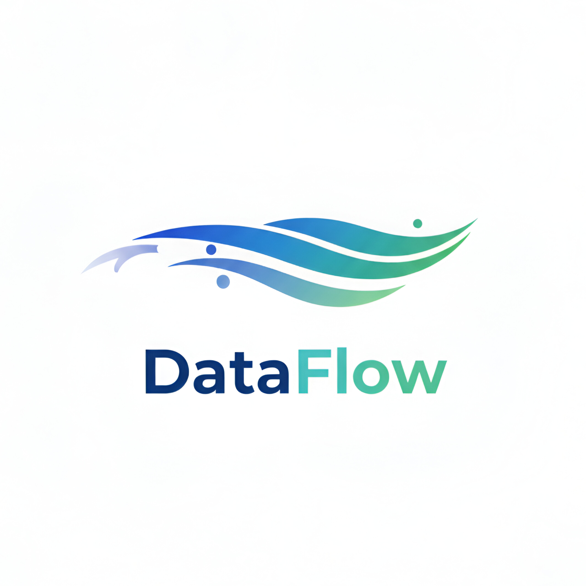
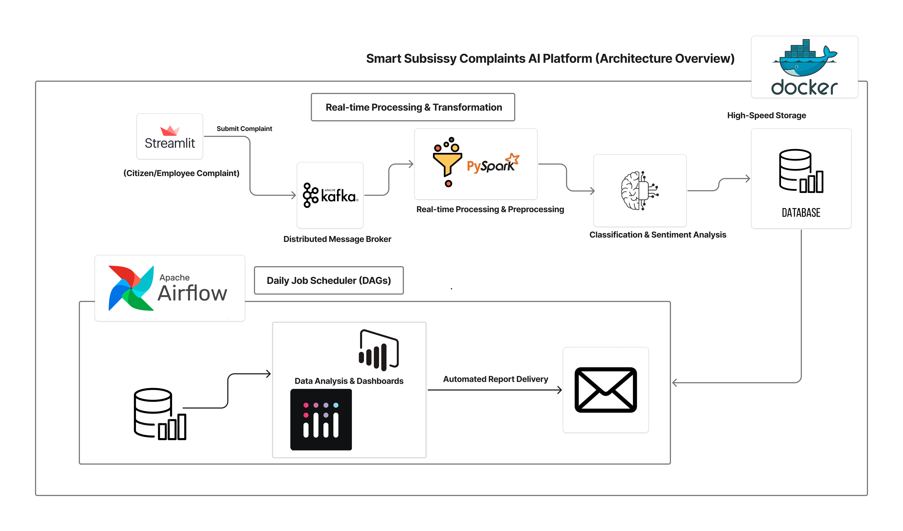
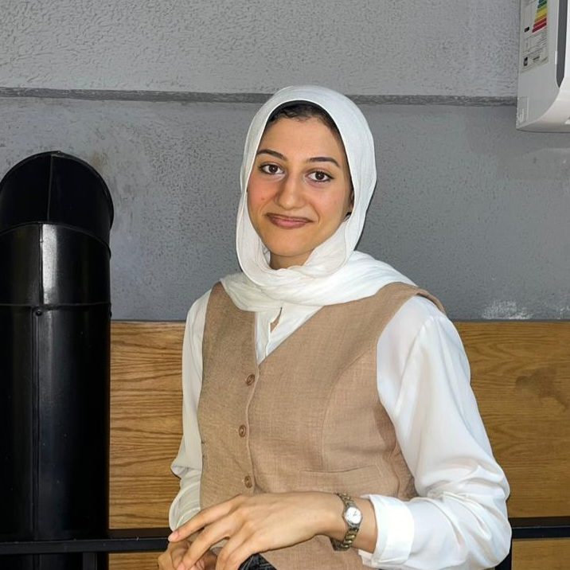
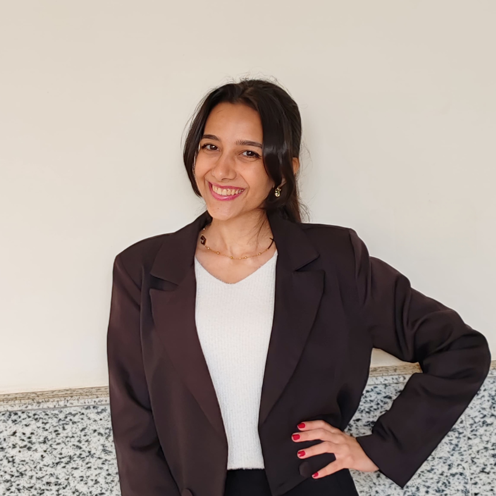
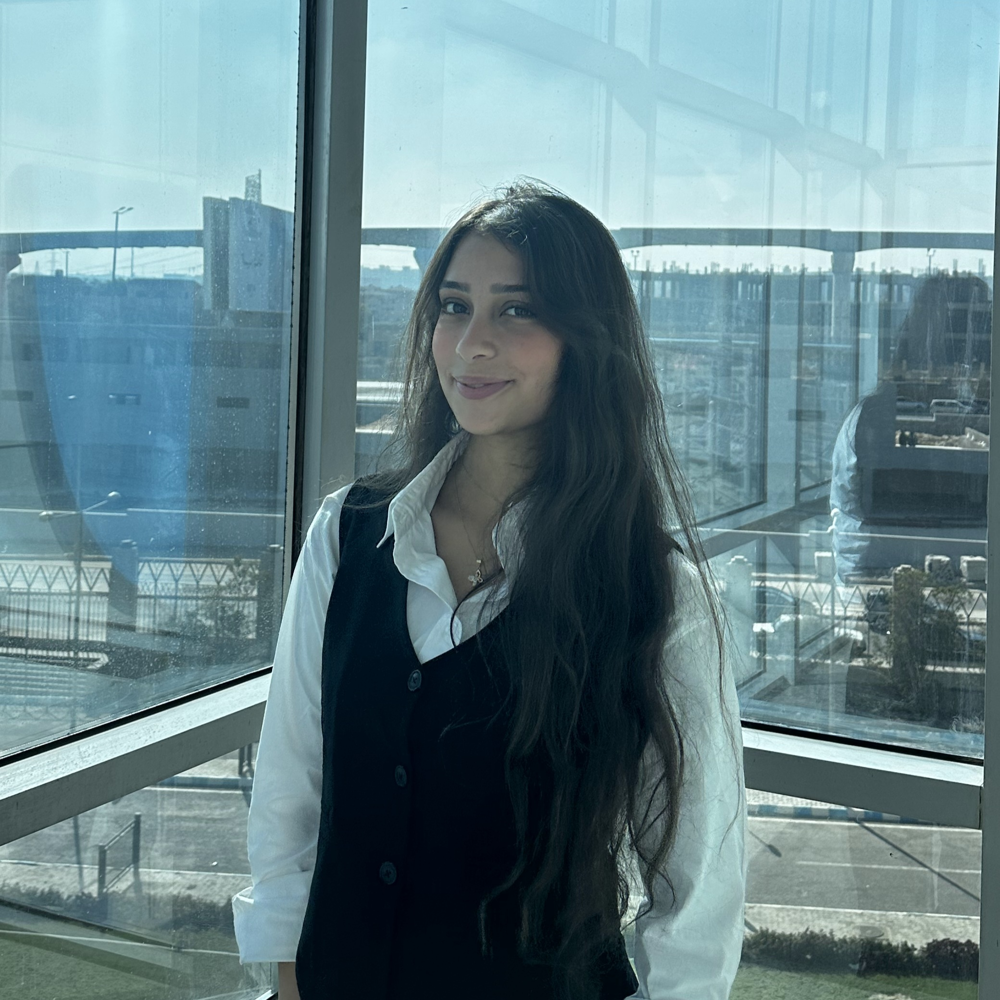

# 🤖 Smart Subsidy Complaints AI Platform

<table style="border-collapse: collapse; border-spacing: 0;">
  <tr style="border: none;">
    <td align="left" width="140" style="border:none;">
      
    </td>
    <td align="left" valign="middle" style="border:none;">
      <h1 style="margin: 0; font-size: 40px;">DataFlow</h1>
        

        
        
        
        
        
        
        
        

    </td>
  </tr>
</table>

---

## 📖 About The Project

This project aims to build an **AI-powered Big Data platform** for managing and analyzing subsidy-related complaints in Arabic. It enables **real-time collection, processing, and analysis** of citizen complaints to improve **transparency, efficiency, and service quality**.

The system combines **Streamlit, Kafka, Spark, Airflow, and PostgreSQL** inside a fully containerized **Docker** environment to automate the data flow from initial submission to final insight.

This project was created for the **AI & Data Science Track - Round 3** of the **Digital Egypt Pioneers** program, sponsored by the **Ministry of Communications and Information Technology**.

### ✨ Core Features

- **Real-Time Ingestion:** A Streamlit web app captures user complaints and sends them instantly to a Kafka topic.
- **AI-Powered Classification:** A fine-tuned **`arabert`** model from Hugging Face performs multi-label classification to categorize complaints (e.g., `BREAD_QUALITY`, `STAFF_BEHAVIOR`, `CARD_ISSUE`).
- **Scalable Stream Processing:** **Apache Spark** (Structured Streaming) consumes data from Kafka, applies AI model inference in real-time, and writes structured results to PostgreSQL.
- **Workflow Orchestration:** **Apache Airflow** manages scheduled batch jobs, such as generating daily summary reports.
- **Interactive Dashboard:** A second Streamlit page queries the PostgreSQL database to display real-time analytics, charts, and key performance indicators.

---

## 🏗️ Architecture Overview

---

## 🛠️ Technologies & Tools

| Category              | Technology                  | Purpose                                                                        |
| :-------------------- | :-------------------------- | :----------------------------------------------------------------------------- |
| **Containerization**  | Docker & Docker Compose     | To build, run, and manage all services in an isolated environment.             |
| **User Interface**    | Streamlit                   | For the complaint submission form and the analytics dashboard.                 |
| **Message Broker**    | Apache Kafka & Zookeeper    | For real-time, fault-tolerant data ingestion as a message queue.               |
| **Stream Processing** | Apache Spark                | To consume from Kafka, run AI model inference, and process data.               |
| **AI & NLP**          | Hugging Face `transformers` | To load and fine-tune the `arabert` model for multi-label text classification. |
| **Orchestration**     | Apache Airflow              | To schedule and monitor batch data pipelines (e.g., daily reports).            |
| **Database**          | PostgreSQL                  | To store the structured, analyzed complaint data for the dashboard.            |
| **Monitoring**        | Kafka UI                    | To easily view topics and messages in the Kafka cluster.                       |

---

## 📊 Project Milestones

This project is being built in the following phases:

- **Milestone 1: Foundations & Data Preparation**

  - Define the multi-label classification schema and create a labeled dataset of 500-1,000 Arabic complaints.

- **Milestone 2: The End-to-End "Skeleton" Pipeline**

  - Build the full data pipeline (`Streamlit` -> `Kafka` -> `Spark` -> `PostgreSQL`) using a **"dummy" AI model** to ensure the plumbing works.

- **Milestone 3: The AI Model (Fine-Tuning)**

  - Use the labeled data from Milestone 1 to fine-tune the `arabert` model for our specific complaint categories.

- **Milestone 4: Integration, Orchestration & Polish**

  - Replace the "dummy" logic in the Spark job with the real, fine-tuned AI model using a Pandas UDF.
  - Build an Airflow DAG for a daily summary report.

- **Milestone 5: Final Testing & Documentation**
  - Perform end-to-end testing and finalize all project documentation.

---

## 👥 Team Members

  

    
<b style="font-size: 20px; color: #e2e8f0;">Meet Our Team</b>

    <table style="border-collapse: collapse; border-spacing: 0;">
      <tr style="border: none;">
        <td align="center" width="180px" style="border: none; padding: 15px;">
           
          <b style="font-size: 15px; color: #e2e8f0;">Medhat Mohamed Ezzat</b> 
          

            
            
            
          

        </td>
        <td align="center" width="180px" style="border: none; padding: 15px;">
           
          <b style="font-size: 15px; color: #e2e8f0;">Rawan Samy Nada</b> 
          

            
            
            
          

        </td>
        <td align="center" width="180px" style="border: none; padding: 15px;">
           
          <b style="font-size: 15px; color: #e2e8f0;">George Ezzat Hosni</b> 
          

            
            
            
          

        </td>
      </tr>
      <tr style="border: none;">
        <td align="center" width="180px" style="border: none; padding: 15px;">
           
          <b style="font-size: 15px; color: #e2e8f0;">Farah Maurice Wanis</b> 
          

            
            
            
          

        </td>
        <td align="center" width="180px" style="border: none; padding: 15px;">
           
          <b style="font-size: 15px; color: #e2e8f0;">David Sameh Fouad</b> 
          

            
            
            
          

        </td>
        <td align="center" width="180px" style="border: none; padding: 15px;">
           
          <b style="font-size: 15px; color: #e2e8f0;">Jana Amr Abdelhamed</b> 
          

            
            
            
          

        </td>
      </tr>
    </table>
  

---
