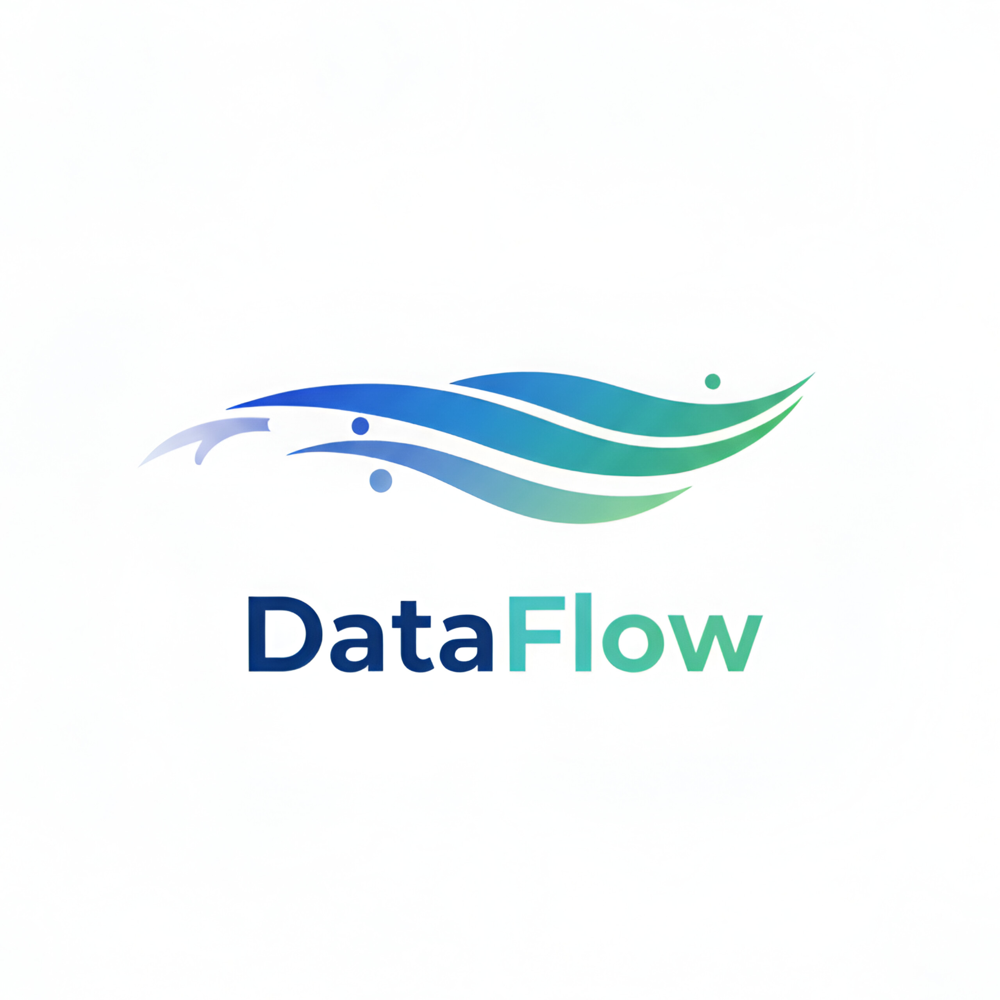
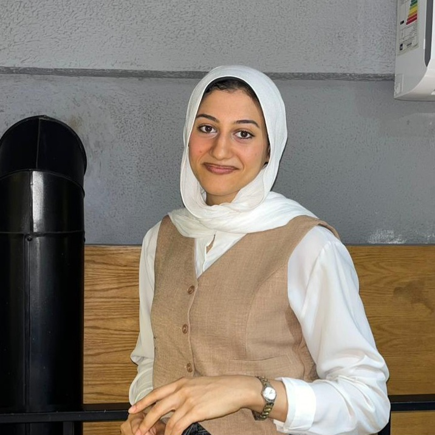
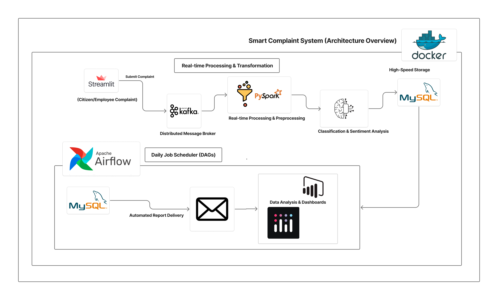

# 📢 Smart Complaint System

<table style="border-collapse: collapse; border-spacing: 0;">
  <tr style="border: none;">
    <td align="left" width="140" style="border:none;">
      
    </td>
    <td align="left" valign="middle" style="border:none;">
      <h1 style="margin: 0; font-size: 40px;">DataFlow Team</h1>
        <p>
        
        
        
        
        
        
        
        </p>
    </td>
  </tr>
</table>

---

## 📖 About The Project

**Smart Complaint System** is an intelligent, event-driven Big Data platform designed to automate the handling of customer complaints. Developed as part of the **Digital Egypt Pioneers Initiative (DEPI) - Round 3 (Huawei Big Data Program)**, this system addresses the challenges of manual complaint sorting by leveraging real-time stream processing and Natural Language Processing (NLP).

The platform ingests unstructured complaints, uses a fine-tuned **BERT model** to categorize them and assess sentiment severity in real-time, and generates automated reports for stakeholders. The entire infrastructure is containerized for seamless deployment.

### ✨ Core Features

- **🚀 Real-Time Ingestion:** A user-friendly **Streamlit** interface captures complaints and streams them instantly to **Apache Kafka**.
- **🧠 AI-Powered Inference:** - **Classification:** Routes complaints to 5 departments (e.g., `Bread Quality`, `Staff Behavior`, `System Down`) using a fine-tuned BERT model.
  - **Sentiment Analysis:** Calculates a "Severity Score" (High/Medium/Low) based on the emotional tone of the text.
- **⚡ Scalable Stream Processing:** **Apache Spark Structured Streaming** processes data in micro-batches, applying "Lazy Loading" for efficient model inference.
- **🗄️ Persistent Storage:** Processed data is stored in **MySQL** for historical analysis.
- **📧 Automated Reporting:** **Apache Airflow** orchestrates a weekly workflow to generate Excel reports and email them directly to stakeholders.

---

## 👥 Team Members

<div style="display: flex; justify-content: center;">
  <div align="center" style="background: linear-gradient(135deg, #2d3748 0%, #4a5568 100%); padding: 30px; border-radius: 15px; box-shadow: 0 4px 6px   rgba(0,0,0,0.3);">
    <p><b style="font-size: 20px; color: #e2e8f0;">Meet Our Team</b><p>
    <table style="border-collapse: collapse; border-spacing: 0;">
      <tr style="border: none;">
        <td align="center" width="180px" style="border: none; padding: 15px;">
          <br/>
          <sub><b style="font-size: 15px; color: #e2e8f0;">Medhat Mohamed Ezzat</b></sub><br/>
          <div style="margin-top: 8px;">
            <a href="https://www.linkedin.com/in/medhat-mohamed-ezzat-03a58b235">
              
            </a>
            <a href="https://www.github.com/medhat2525548">
              
            </a>
            <a href="mailto:medhatsaid56@gmail.com">
              
            </a>
          </div>
        </td>
        <td align="center" width="180px" style="border: none; padding: 15px;">
          <br/>
          <sub><b style="font-size: 15px; color: #e2e8f0;">Rawan Samy Nada</b></sub><br/>
          <div style="margin-top: 8px;">
            <a href="https://www.linkedin.com/in/rawan-nada-a63994281">
              
            </a>
            <a href="https://www.github.com/Rawannada">
              
            </a>
            <a href="mailto:Rwannada22@gmail.com">
              
            </a>
          </div>
        </td>
        <td align="center" width="180px" style="border: none; padding: 15px;">
          <br/>
          <sub><b style="font-size: 15px; color: #e2e8f0;">George Ezzat Hosni</b></sub><br/>
          <div style="margin-top: 8px;">
            <a href="https://www.linkedin.com/in/george-ezat">
              
            </a>
            <a href="https://www.github.com/george-ezat">
              
            </a>
            <a href="mailto:e.georgeezat@gmail.com">
              
            </a>
          </div>
        </td>
      </tr>
      <tr style="border: none;">
        <td align="center" width="180px" style="border: none; padding: 15px;">
          <br/>
          <sub><b style="font-size: 15px; color: #e2e8f0;">Farah Maurice Wanis</b></sub><br/>
          <div style="margin-top: 8px;">
            <a href="https://www.linkedin.com/in/farah-maurice-058b20259">
              
            </a>
            <a href="https://www.github.com/Farahmaurice">
              
            </a>
            <a href="mailto:farahmaurice3@gmail.com">
              
            </a>
          </div>
        </td>
        <td align="center" width="180px" style="border: none; padding: 15px;">
          <br/>
          <sub><b style="font-size: 15px; color: #e2e8f0;">David Sameh Fouad</b></sub><br/>
          <div style="margin-top: 8px;">
            <a href="https://www.linkedin.com/in/davidsamehfouad">
              
            </a>
            <a href="https://www.github.com/DavidSFouad">
              
            </a>
            <a href="mailto:davidsameh302@gmail.com">
              
            </a>
          </div>
        </td>
        <td align="center" width="180px" style="border: none; padding: 15px;">
          <br/>
          <sub><b style="font-size: 15px; color: #e2e8f0;">Jana Amr Abdelhamed</b></sub><br/>
          <div style="margin-top: 8px;">
            <a href="https://www.linkedin.com/in/jana-amr-0362852b0">
              
            </a>
            <a href="https://www.github.com/Jaanaamrr">
              
            </a>
            <a href="mailto:j.amr2313@nu.edu.eg">
              
            </a>
          </div>
        </td>
      </tr>
    </table>
  </div>
</div>

---

## 🏗️ Architecture Overview

The system follows a microservices architecture orchestrated by Docker Compose:

1.  **Producer:** Streamlit App $\rightarrow$ Validates input $\rightarrow$ Sends JSON to Kafka.
2.  **Message Broker:** Apache Kafka buffers high-velocity data.
3.  **Processor:** Spark Streaming consumes data $\rightarrow$ Loads AI Models $\rightarrow$ Writes to MySQL.
4.  **Storage:** MySQL database stores the raw text and AI predictions.
5.  **Orchestrator:** Airflow runs weekly jobs to extract data from MySQL and send email summaries.



---

## 🛠️ Technologies & Tools

| Category              | Technology                  | Purpose                                                                        |
| :-------------------- | :-------------------------- | :----------------------------------------------------------------------------- |
| **Containerization** | Docker & Docker Compose     | Orchestration of the 5-service stack (Kafka, Spark, MySQL, Airflow, Streamlit).|
| **User Interface** | Streamlit                   | Interactive web form for complaint submission with validation logic.           |
| **Message Broker** | Apache Kafka                | Decoupled, fault-tolerant message buffering.                                   |
| **Stream Processing** | Apache Spark (PySpark)      | Distributed processing engine for real-time AI inference.                      |
| **AI & NLP** | Hugging Face (PyTorch)      | Fine-tuned BERT models for Arabic text classification.                         |
| **Storage** | MySQL 8.0                   | Relational database for storing analyzed complaints.                           |
| **Orchestration** | Apache Airflow              | Scheduling weekly reporting and email notifications.                           |

---

## 🚀 Getting Started

### Prerequisites
- Docker Desktop installed and running.
- 4GB+ RAM available for containers.

### Installation

1. **Clone the repository**
   ```bash
   git clone [https://github.com/medhat2525548/smart-complaint-system.git](https://github.com/medhat2525548/smart-complaint-system.git)
   cd smart-complaint-system
   ```

2.  **Download AI Models**
    Ensure the fine-tuned models are placed in the `processor/models/` directory:

      - `processor/models/category_model/`
      - `processor/models/sentiment_model/`

3.  **Start the Services**

    ```bash
    docker-compose up --build -d
    ```

4.  **Access the Interfaces**

      - **Complaint Portal:** `http://localhost:8501`
      - **Spark UI:** `http://localhost:8080`
      - **Airflow UI:** `http://localhost:8081` (User/Pass: `admin`/`admin`)

---
